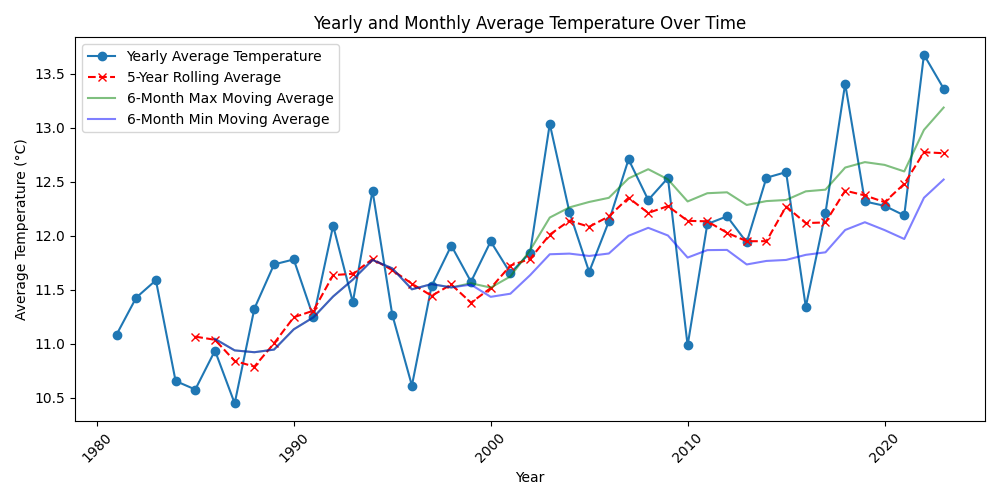
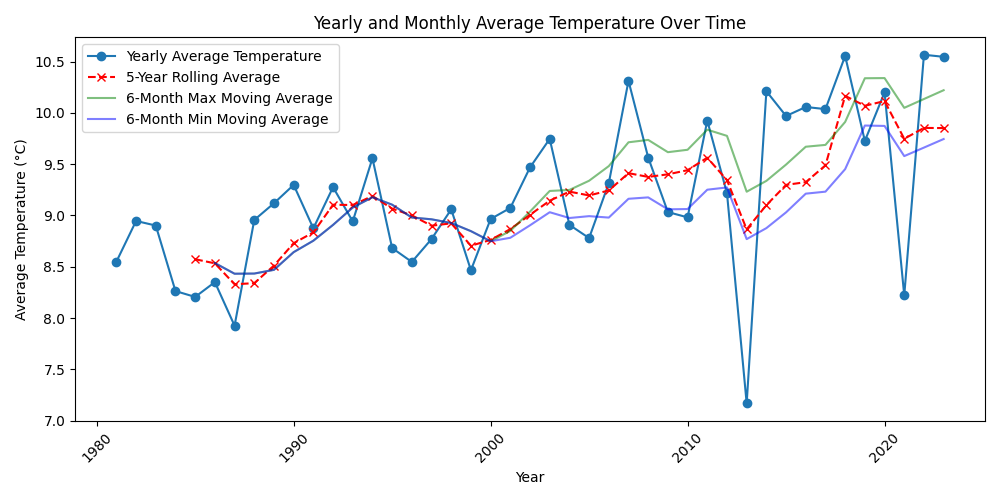
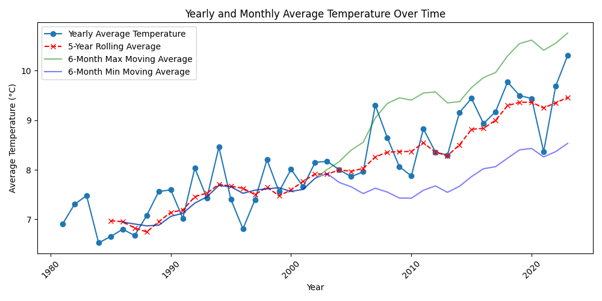

# water temperature visualizer

Water reacts slower to temperature spikes, and we have structured data since the 80s we can use.

Everyone can proof this data here: 
https://www.gkd.bayern.de/

Examples:

Donau:

Inn:

Ilz:

